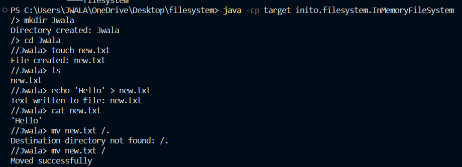

In-Memory File System (IMFS) Documentation

Overview

The In-Memory File System (IMFS) is implemented as a command-line interface (CLI) application with a focus on simplicity and efficiency. The system is built using Java and Maven for project management. The primary data structures include in-memory representations of directories and files.

Table of Contents

<ol>
<li>Project Structure</li>
<li>Features</li>
<li>Setup and Installation</li>
<li>Usage</li>
<li>Data Structures</li>
<li>Design Decisions</li>
</ol>

Project Structure

.
├───.mvn
│   └───wrapper
├───.vscode
├───inito
│   └───filesystem
├───src
│   ├───main
│   │   ├───java
│   │   │   └───inito
│   │   │       └───filesystem
│   │   │           └───commands
│   │   └───resources
│   └───test
│       └───java
│           └───inito
│               └───filesystem
└───target
    ├───classes
    │   └───inito
    │       └───filesystem
    │           └───commands
    ├───generated-sources
    │   └───annotations
    ├───generated-test-sources
    │   └───test-annotations
    ├───inito
    │   └───filesystem
    │       └───commands
    ├───maven-status
    │   └───maven-compiler-plugin
    │       ├───compile
    │       │   └───default-compile
    │       └───testCompile
    │           └───default-testCompile
    ├───surefire-reports
    └───test-classes
        └───inito
            └───filesystem

Features

The IMFS supports the following file system operations:

<ol>
<li>mkdir: Create a new directory.</li>
<li>cd: Change the current directory.</li>
<li>ls: List the contents of the current or specified directory.</li>
<li>grep: Search for a pattern in a file (bonus feature).</li>
<li>cat: Display the contents of a file.</li>
<li>touch: Create a new empty file.</li>
<li>echo: Write text to a file.</li>
<li>mv: Move a file or directory to another location.</li>
<li>cp: Copy a file or directory to another location.</li>
<li>rm: Remove a file or directory.</li>
</ol>

Setup and Installation

To set up the project, follow these steps:

Clone the Repository:

git clone <a href="https://github.com/your-username/inmemoryfilesystem.git">https://github.com/your-username/inmemoryfilesystem.git</a>

cd inmemoryfilesystem

Compile Java Source Files:

javac -d target src/main/java/inito/filesystem/<em>.java src/main/java/inito/filesystem/commands/</em>.java

Run the File System:

java -cp target inito.filesystem.InMemoryFileSystem

Usage

The IMFS is a command-line application. After running the system, you can execute various commands to interact with the file system.

Example Commands:

<ol>
<li>mkdir new_directory: Create a new directory named &quot;new_directory.&quot;</li>
<li>cd new_directory: Change the current directory to &quot;new_directory.&quot;</li>
<li>ls: List the contents of the current directory.</li>
<li>cat file.txt: Display the contents of &quot;file.txt.&quot;</li>
</ol>

Refer to the Features section for a complete list of supported commands.

Data Structures Used

Directory Structure
The core of the In-Memory File System (IMFS) is modeled as a tree structure of directories, with each directory having references to its children (subdirectories and files). The primary attributes of the Directory class include:

public class Directory {
    private String name;
    private Map&lt;String, Directory&gt; directories;
    private Map&lt;String, File&gt; files;
    // Other attributes and methods
}

File Structure
Files are represented by the File class, which holds the content of the file along with other relevant attributes:

public class File {
    private String name;
    private String content;
    // Other attributes and methods
}

Design Decisions

Modularity: Implemented using the Command Design Pattern for extensibility.

In-Memory Storage: All file system data stored in memory for fast access.

Directory Structure: Hierarchical tree-like structure for effective navigation.

